# Oba – Rise of Kingdoms

**Version 0.19.1** · *A 4X Turn-Based Strategy Game*

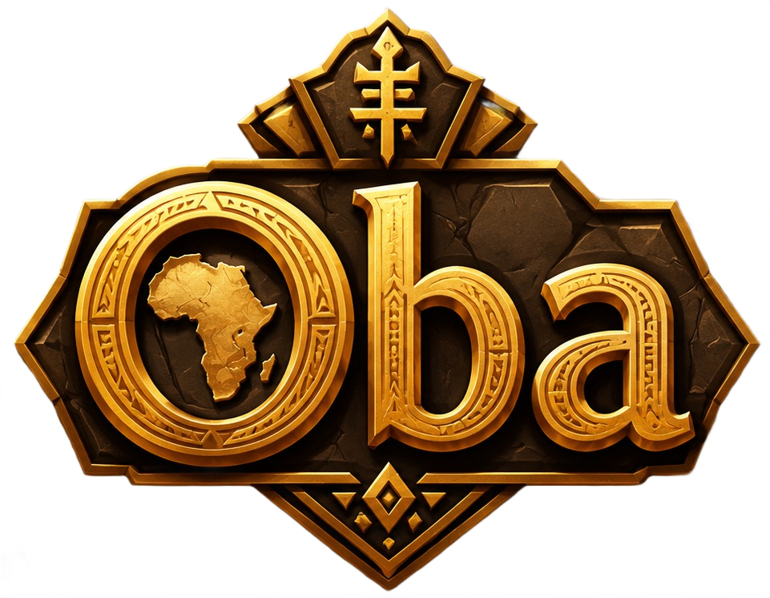

---

## Table of Contents

1. [Introduction](#introduction)
2. [Story & Mythology](#story--mythology)
3. [Tribes](#tribes)
   - [Tribe List](#tribe-list)
   - [Tribe Bonuses & Personalities](#tribe-bonuses--personalities)
4. [Units](#units)
   - [Land Units](#land-units)
   - [Naval Units](#naval-units)
   - [Unit Stats & Costs](#unit-stats--costs)
   - [Veterancy & Upgrades](#veterancy--upgrades)
5. [Game Mechanics](#game-mechanics)
   - [Turn Structure](#turn-structure)
   - [Movement & Pathfinding](#movement--pathfinding)
   - [Combat](#combat)
   - [City Management](#city-management)
   - [Technology Tree](#technology-tree)
   - [Wonders](#wonders)
   - [Resources & Improvements](#resources--improvements)
     - [Mines](#mines)
     - [Quarries](#quarries)
     - [Farms](#farms)
     - [Fishing Boats](#fishing-boats)
     - [Sawpits](#sawpits)
   - [Harbors & Naval Production](#harbors--naval-production)
   - [City Upgrades & Special Buildings](#city-upgrades--special-buildings)
   - [Fog of War & Vision](#fog-of-war--vision)
   - [Influence & Territory](#influence--territory)
   - [Victory Conditions](#victory-conditions)
6. [AI & Difficulty](#ai--difficulty)
7. [User Interface](#user-interface)
   - [Top Bar](#top-bar)
   - [Bottom Bar](#bottom-bar)
   - [Action Popup](#action-popup)
   - [Modal Dialogs](#modal-dialogs)
8. [Game Modes](#game-modes)
   - [Conquest](#conquest)
   - [Sands of Time](#sands-of-time)
   - [Oba](#oba)
   - [Custom](#custom)
9. [Images & Assets](#images--assets)
10. [Tips & Strategies](#tips--strategies)
11. [Credits](#credits)

---

## Introduction

**Oba – Rise of Kingdoms** is a turn‑based 4X strategy game set in ancient Africa. Lead your tribe from a small settlement to a mighty empire. Conquer rivals, research technologies, build wonders, and control the continent.

The game features:
- 12 distinct African tribes with unique units and AI personalities.
- A dynamic hexagonal map with varied terrain (plains, forest, mountain, water, hill, desert).
- Over a dozen technologies and four world wonders.
- City management, unit production, and tactical combat.
- Multiple game modes: Conquest, Sands of Time, Oba (all tribes, hard AI), and Custom.
- Persistent saving and loading.

---

## Story & Mythology

In the dawn of time, the first **Oba** – a divine king – united the scattered peoples of the continent. He forged the twelve great tribes, each blessed with a unique gift from the spirits of the land. But the Oba grew old, and upon his passing, the tribes fell into rivalry. Now, each chieftain seeks to claim the title of **Oba** – the King of Kings – by conquering all others or proving their dominance through wisdom and strength.

The spirits of the ancestors watch over the battlefields. Whispers of forgotten **Wonders** – the Pyramids of Giza, the Great Zimbabwe, the University of Timbuktu, and the Axum Obelisks – promise unmatched power to those who rebuild them. The **Sands of Time** wait for no one; if no ruler emerges, the land will choose the one who holds the most territory when the hourglass runs dry.

Will you rise as the Oba, or will your name be lost to the desert winds?

---

## Tribes

Each tribe has its own history, unit roster, colour, icon, and AI personality. Choose wisely – your tribe’s strengths shape your path to victory.

### Tribe List

| Tribe    | Icon                             | Colour      | Description                        |
|----------|----------------------------------|-------------|------------------------------------|
| Zulu     | 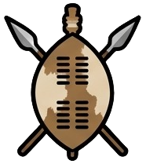          | #c0392b     | Fierce warriors of the south       |
| Ashanti  | 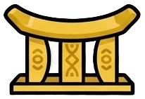    | #d4a017     | Golden kingdom of the west         |
| Yoruba   |       | #2e7d32     | Spiritual warriors of the forest   |
| Maasai   | 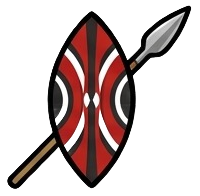      | #c0392b     | Lion‑hearted nomads of the savanna |
| Berber   | 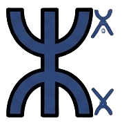      | #8d6e3f     | Desert riders of the north         |
| Hausa    |         | #6d4c41     | Trading empire of the Sahel        |
| Dogon    | 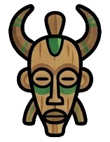        | #37474f     | Mystical cliff‑dwellers of Mali    |
| Songhai  | 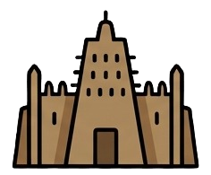    | #f39c12     | Mighty river empire of the Niger   |
| Oromo    |         | #4caf50     | Highland warriors of Ethiopia      |
| Tutsi    | 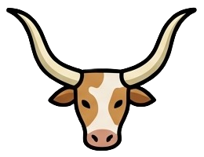        | #5d4037     | Cattle‑herding nobility of Rwanda  |
| Swahili  |     | #00897b     | Coastal traders of East Africa     |
| Nubian   | 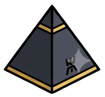      | #4e342e     | Archers of the Nile Valley         |

### Tribe Bonuses & Personalities

Each AI‑controlled tribe has a distinct **personality** that influences its behaviour:

| Tribe    | Aggression | Coordination | Expansion | Defense | Tactic        | Research Priority (first) | Unit Preference |
|----------|------------|--------------|-----------|---------|---------------|---------------------------|-----------------|
| Zulu     | 0.9        | 0.8          | 0.9       | 0.3     | rush          | Bronze Working            | Foot, Mounted   |
| Ashanti  | 0.7        | 0.7          | 0.8       | 0.4     | balanced      | Masonry                   | Shield, Ranged  |
| Yoruba   | 0.6        | 0.6          | 0.6       | 0.6     | defensive     | Masonry                   | Shield, Ranged  |
| Maasai   | 0.8        | 0.9          | 0.9       | 0.3     | mobile        | Horseback                 | Scout, Mounted  |
| Berber   | 0.7        | 0.8          | 0.8       | 0.4     | hit_and_run   | Horseback                 | Mounted, Ranged |
| Hausa    | 0.6        | 0.6          | 0.8       | 0.5     | trade         | Trade                     | Foot, Shield    |
| Dogon    | 0.5        | 0.5          | 0.5       | 0.7     | defensive     | Masonry                   | Shield, Ranged  |
| Songhai  | 0.8        | 0.7          | 0.9       | 0.3     | river_rush    | Sailing                   | Foot, Warship   |
| Oromo    | 0.7        | 0.8          | 0.7       | 0.5     | highland      | Bronze Working            | Mounted, Foot   |
| Tutsi    | 0.6        | 0.7          | 0.7       | 0.5     | cattle_raids  | Horseback                 | Mounted, Scout  |
| Swahili  | 0.5        | 0.6          | 0.8       | 0.5     | trade         | Sailing                   | Galley, Warship |
| Nubian   | 0.7        | 0.7          | 0.6       | 0.6     | archer        | Bronze Working            | Ranged, Shield  |

---

## Units

Units are the backbone of your army. Each tribe has its own unique unit names, but stats and costs are standardised per type. Units can be produced in cities (using **productivity**) or bought with **gold** (double the production cost, modified by discounts). Some units require specific technologies to unlock.

### Land Units

| Type     | Name (example) | Move | Attack | Defense | HP  | Cost (prod) | Vision | Attack Range | Tech Required | Notes                                |
|----------|---------------|------|--------|---------|-----|-------------|--------|--------------|---------------|--------------------------------------|
| Scout    | Impi Scout    | 5    | 1      | 1       | 12  | 20          | 4      | 1            | –             | Fast, cheap, high vision             |
| Foot     | Impi Warrior  | 2    | 5      | 4       | 20  | 40          | 2      | 1            | –             | Standard infantry                    |
| Mounted  | Mounted Impi  | 4    | 6      | 3       | 22  | 55          | 3      | 1            | Horseback     | Mobile, good attack                  |
| Shield   | Shield Bearer | 2    | 2      | 7       | 26  | 45          | 2      | 1            | Masonry       | High defense, tank                   |
| Ranged   | Assegai Thrower| 2    | 6      | 2       | 16  | 50          | 3      | 2            | Bronze Working| Ranged attack                        |
| Elite    | Zulu Elite    | 3    | 7      | 5       | 28  | 70          | 3      | 1            | Iron Working  | Strong all‑rounder                   |
| Tank     | War Elephant | 2    | 8      | 7       | 40  | 100         | 2      | 1            | Engineering   | Slow but devastating                 |
| General  | Shaka         | 3    | 6      | 5       | 30  | 120         | 4      | 1            | Philosophy    | Special ability (varies per tribe)   |

**General Abilities:**
- Zulu: All units +1 attack.
- Ashanti: +1 gold per city.
- Yoruba: Units heal +2/turn.
- Maasai: +1 move to all units.
- Berber: Desert combat bonus.
- Hausa: Trade routes +2 gold.
- Dogon: Vision range +2.
- Songhai: +1 attack to all units.
- Oromo: Highland combat bonus.
- Tutsi: Cattle provide +1 gold.
- Swahili: Trade +3 gold per turn.
- Nubian: Archers +1 range.

### Naval Units

Naval units are built in **Harbors** (requires **Sailing**) and can move on water. They are essential for coastal control and exploration.

| Type     | Name (example) | Move | Attack | Defense | HP  | Cost (prod) | Vision | Tech Required | Notes                        |
|----------|---------------|------|--------|---------|-----|-------------|--------|---------------|------------------------------|
| Raft     | Raft          | 1    | 0      | 0       | 8   | 20          | 1      | Sailing       | Slow transport (can board)   |
| Galley   | Galley        | 3    | 2      | 1       | 15  | 40          | 2      | Navigation    | Fast coastal raider          |
| Warship  | Warship       | 2    | 5      | 4       | 25  | 70          | 3      | Shipbuilding  | Powerful combat ship         |

**Boarding & Disembarking:**
- A land unit (except Tanks) adjacent to water can **Build a Raft** (costs 20 gold, requires Sailing). The unit moves onto the water tile and becomes a Raft.
- A naval unit that moves onto a land tile will **disembark** automatically:
  - Raft → Scout
  - Galley → Ranged
  - Warship → Elite

### Unit Stats & Costs

- **Movement**: Number of hexes a unit can move per turn.
- **Attack**: Base damage dealt in combat.
- **Defense**: Reduces damage taken.
- **HP**: Health; when it reaches 0, the unit is destroyed.
- **Cost**: Productivity required to produce in a city. Gold cost is double this (modified by discounts).
- **Vision**: Number of hexes revealed around the unit (fog of war).
- **Attack Range**: 1 for melee, 2 for ranged units.

**Veterancy & Upgrades**
- After **3 victories** in combat, a unit becomes **Veteran** (+1 attack, +1 defense, +5 HP).  
  
- After **5 victories**, it becomes **Legendary** (additional +1 attack, +1 defense, +5 HP).  
  

---

## Game Mechanics

### Turn Structure

Each turn consists of:
1. **Player Phase**: Move units, attack, use abilities, manage cities, research, etc.
2. **End Turn** – All units heal 5 HP if they did not move/attack. Cities produce stockpile. Harbors produce ships. Gold income is calculated.
3. **AI Phase** – All enemy tribes take their turns simultaneously (but processed sequentially).
4. **Turn Counter** increments.

### Movement & Pathfinding

- Click a unit to select it. A popup appears with available actions.
- To **Move**, click a highlighted (green) hex within movement range. Pathfinding finds the shortest route.
- Terrain affects movement cost:
  - Plains/Desert: 1
  - Forest/Hill: 2
  - Mountain: 2 (but can be traversed)
  - Water: impassable for land units, passable for naval.
- Units cannot move onto tiles occupied by enemy units (except to attack).

### Combat

- Click **Attack** from the action popup, then click an enemy unit within attack range.
- Ranged units can attack from 2 hexes away.
- Combat resolution:
  - Attacker deals `max(1, Attack - Target Defense)` damage.
  - Defender retaliates if the attacker is within its attack range, dealing `max(1, Defender Attack - Attacker Defense)` damage.
- Units killed in combat grant victories to the attacker (veterancy).
- If a tribe loses all units and cities, it is **eliminated**.

### City Management

Cities are the heart of your empire. Each city:
- Produces **stockpile** each turn (`level * 2` + bonuses from Great Zimbabwe).
- Can have a **project** (unit, tech, or wonder) that consumes stockpile and progress.
- **Productivity** (stockpile) is used to complete projects.
- Changing projects does not lose progress – stockpile and progress persist separately.
- Cities have a **level** (1–4): Village, Town, City, Metropolis. Level affects influence radius and production.

**City Actions:**
- **Produce Unit**: Select a unit type; stockpile is applied toward its cost.
- **Research Technology**: Assign a tech to a city; research points contribute.
- **Build Wonder**: Assign a wonder project.
- **Upgrade City**: Costs gold; increases level, influence, and production.
- **Build Library** (level 4): +2 research per turn.  
  
- **Build University** (level 4, requires Library): +4 research per turn.  
  

### Technology Tree

Technologies are grouped into tiers (0–3). Each requires specific prerequisites.

| Tier | Tech              | Cost (research) | Prerequisites          | Bonus Description                      |
|------|-------------------|----------------|------------------------|----------------------------------------|
| 0    | Masonry           | 30             | –                      | +1 defense for all cities              |
| 0    | Bronze Working    | 40             | –                      | +1 attack for all units                |
| 0    | Horseback         | 50             | –                      | +1 move for mounted units              |
| 0    | Sailing           | 45             | –                      | Unlocks Harbors & Rafts                |
| 1    | Iron Working      | 60             | Bronze Working         | +2 attack for foot units               |
| 1    | Engineering       | 70             | Masonry                | +5 HP for all units                    |
| 1    | Philosophy        | 80             | Masonry                | +20% research speed                    |
| 1    | Navigation        | 65             | Sailing                | Unlocks Galleys (fast ships)           |
| 2    | Trade             | 55             | Philosophy             | +2 gold per city                       |
| 2    | Architecture      | 60             | Masonry, Engineering   | City upgrades cost 20% less            |
| 2    | Medicine          | 70             | Philosophy             | Units heal +3 HP per turn              |
| 2    | Siegecraft        | 75             | Iron Working           | +2 attack against cities               |
| 2    | Shipbuilding      | 85             | Navigation             | Unlocks Warships (combat ships)        |
| 3    | Steel Working     | 90             | Iron Working, Engineering| +2 attack for all units              |

**Researching**: Click **📜 Tech** in the top bar. Available technologies are highlighted. Click one, then choose a free city to research it. Research points are generated each turn (city count + bonuses). Progress is tracked per city.

### Wonders

Four great wonders can be built, each providing a powerful empire‑wide bonus. Building a wonder requires a city project; once complete, a wonder icon appears on a nearby tile.

| Wonder                     | Cost (prod) | Requirement | Bonus                                  |
|----------------------------|-------------|-------------|----------------------------------------|
| Pyramids of Giza           | 120         | Masonry     | +5 gold per turn                       |
| Great Zimbabwe             | 140         | Bronze Work.| +3 production per city                 |
| University of Timbuktu     | 100         | Philosophy  | +4 research per turn                   |
| Axum Obelisks              | 90          | Masonry     | +2 vision for all units                |

Wonder icons:  
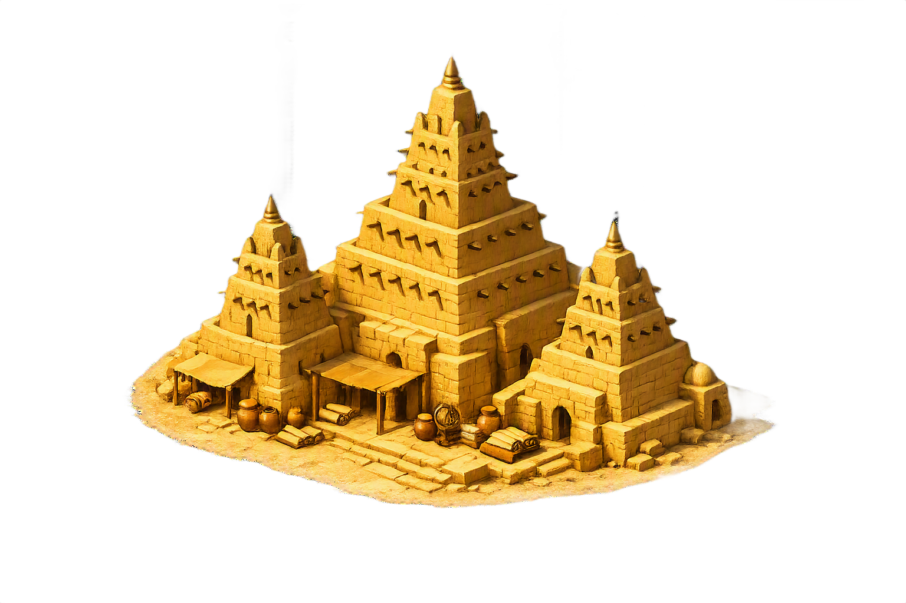  
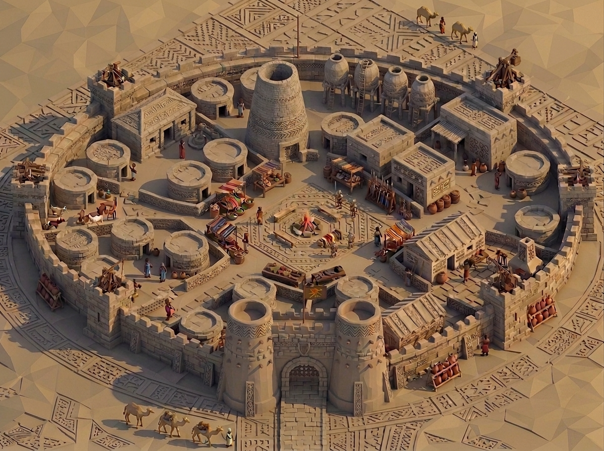  
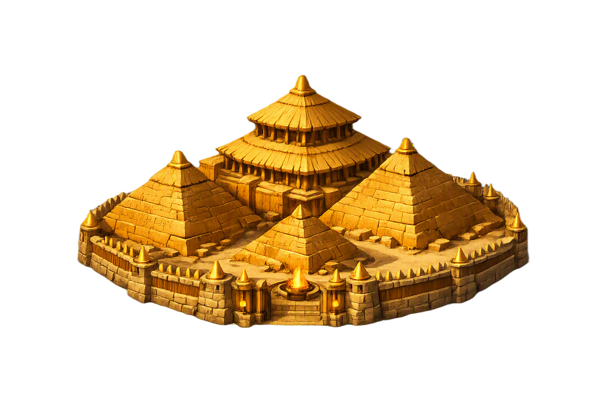  
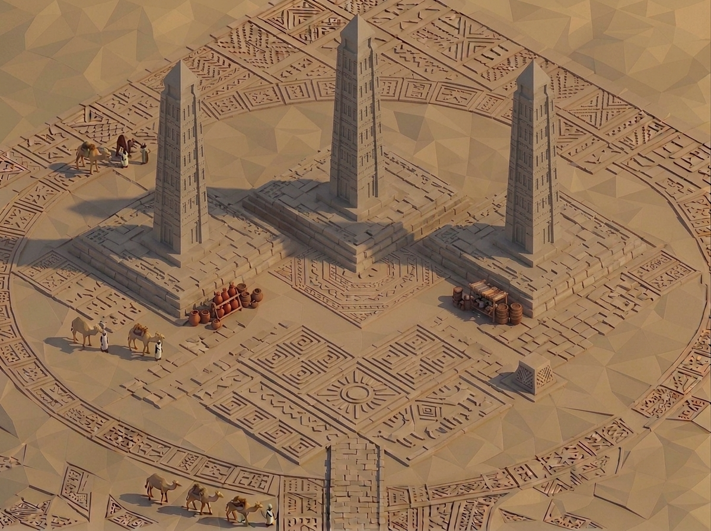

### Resources & Improvements

Resources appear on the map as icons. They can be improved by spending **productivity** (stockpile + project progress). Improvements provide discounts or income.

#### Mines
- **Location**: On gold resources.  
  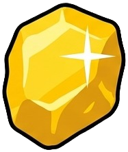
- **Cost**: 5 productivity.
- **Effect**: +2 gold per turn for the controlling city.  
  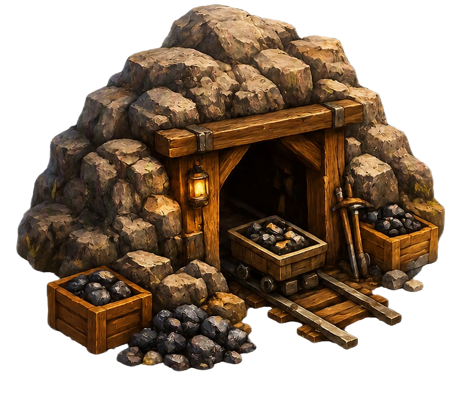

#### Quarries
- **Location**: On stone resources.  
  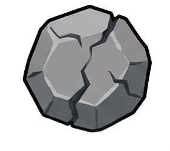
- **Cost**: 5 productivity.
- **Effect**: Reduces unit production cost by 20% in the controlling city.  
  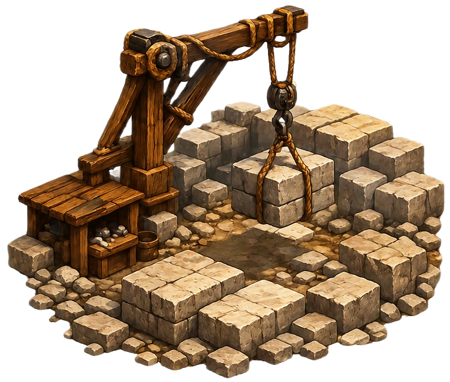

#### Farms
- **Location**: On food resources.  
  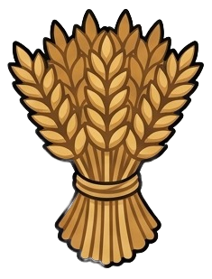
- **Cost**: 2 productivity.
- **Effect**: Reduces city upgrade and unit production costs by 20% in that city.  
  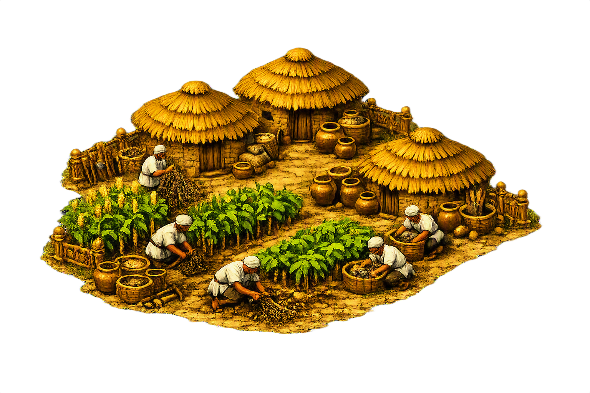

#### Fishing Boats
- **Location**: On fish resources.  
  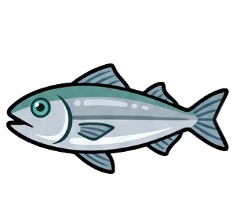
- **Cost**: 2 productivity.
- **Effect**: Reduces city upgrade and unit production costs by 20% in the controlling city.  
  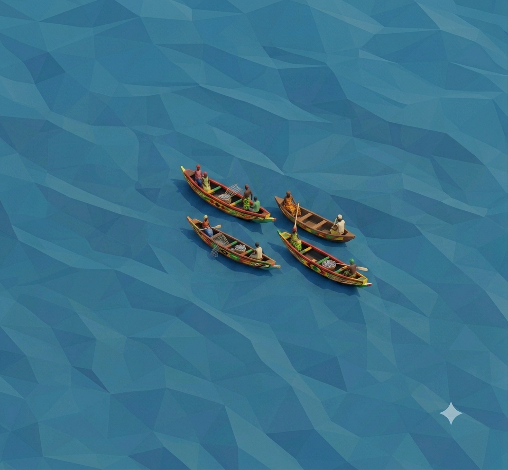

#### Sawpits
- **Location**: On wood resources.  
  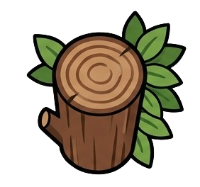
- **Cost**: 2 productivity.
- **Effect**: Reduces shipbuilding cost by 25%, and city upgrade & unit production costs by 10% in the controlling city.  
  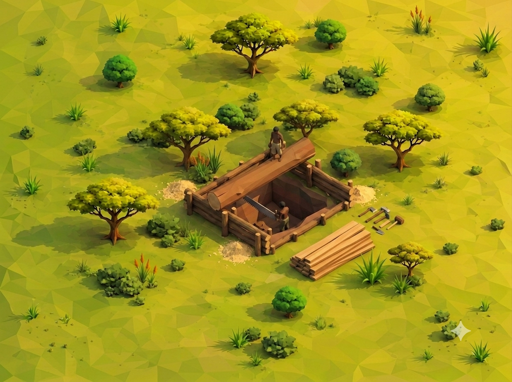

**Stacking**: Multiple improvements in the same city can give cumulative discounts (capped at 80%).

### Harbors & Naval Production

Harbors are built on water tiles adjacent to land, requiring **Sailing** and costing 0 productivity (but must be in a city's influence). They allow production of naval units.  
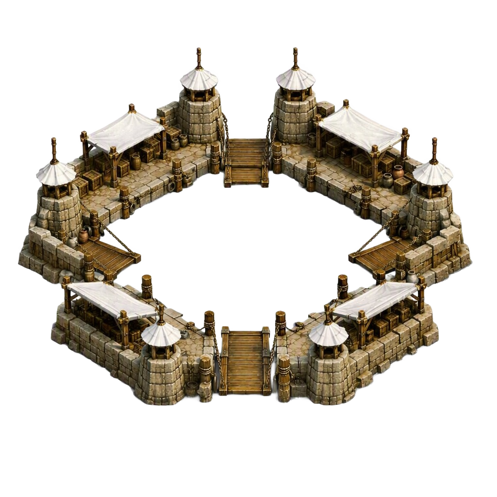

- Harbors have their own production queue, separate from cities.
- Each harbor produces 2 progress per turn (increased by Great Zimbabwe).
- They can produce naval units using productivity, or you can **buy** a naval unit with gold (double cost, modified by discounts).
- Harbors are also where units can embark as rafts.

### City Upgrades & Special Buildings

- **Library**: Requires city level 4 (Metropolis). Costs 100 gold (discounts apply). Adds +2 research per turn.  
  
- **University**: Requires city level 4 and a Library. Costs 200 gold (discounts apply). Adds +4 research per turn.  
  

Both are visible on the city hex.

### Fog of War & Vision

- Unexplored tiles are covered by a dark fog.  
  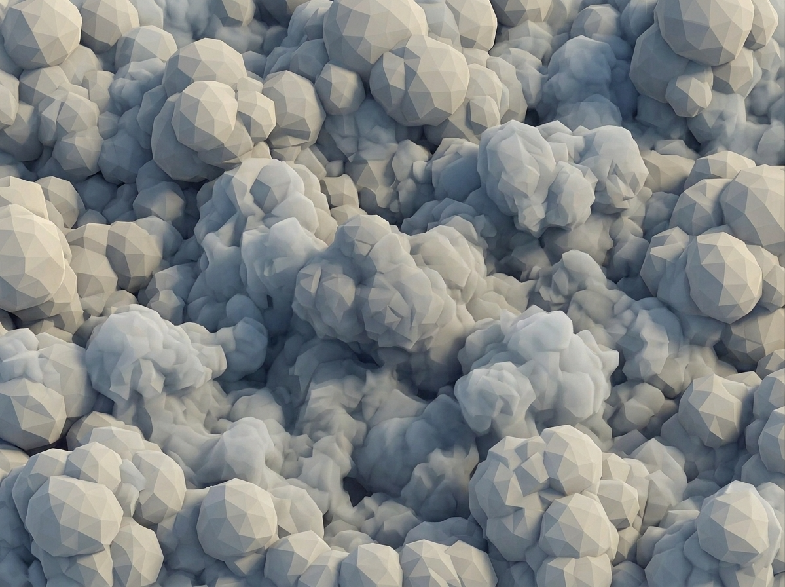
- Units and cities reveal tiles within their vision range.
- Explored tiles remain visible but are dim if not currently seen.

### Influence & Territory

- Each city projects influence over nearby hexes:
  - Level 1 (Village): radius 0 (only its own hex)
  - Level 2 (Town): radius 1
  - Level 3+ (City/Metropolis): radius 2
- Influenced tiles are outlined in the owner's colour.
- Controlling territory is important for **Sands of Time** victory and for resource improvement access.

### Victory Conditions

- **Conquest**: Eliminate all enemy tribes.
- **Sands of Time**: When the turn limit is reached, the player controlling the most hexes wins.
- **Oba mode**: Same as Conquest but with all tribes and hard AI.

If the player is eliminated, the game ends in defeat.

---

## AI & Difficulty

The AI uses personalities (see table) to decide strategies. It:
- Prioritises research and unit production based on its personality.
- Attacks weakest enemies or expands based on game mode.
- Adapts to the situation (defensive if outnumbered, aggressive if strong).
- Difficulty levels (Easy, Normal, Hard) affect AI behaviour and bonuses (currently implemented but subtle).

**Note**: In **Oba** mode, the AI is set to **Hard** by default, making it more aggressive and coordinated.

---

## User Interface

### Top Bar

- **Tribe name & icon**: Your selected tribe (PNG).
- **Turn counter**: `Turn X`.
- **Gold**: Current gold amount (icon from `resource_gold.png`).
- **Research points**: Accumulated research points.
- **📜 Tech**: Opens the Technology Tree modal.
- **☰**: In‑game menu.

### Bottom Bar

- **Unit info**: Displays selected unit's name, stats (attack, defense, movement, HP), or city/harbor info.
- **📊**: Progress & Rankings modal (shows city count and territory for all living tribes).
- **⏭ End**: Ends the current turn.

### Action Popup

When you click a unit, city, harbor, or resource tile, a popup appears with relevant actions:

- **Move** (M): Click a reachable tile.
- **Attack** (A): Click an enemy unit in range.
- **Skip** (Space): Unit ends its turn without action.
- **First Aid** (H): Heals the unit (costs its action).
- **Invigorate** (I): General ability – heals or boosts nearby allied units.
- **Build Raft** (gold cost): Embark onto adjacent water.
- **Manage City** (B): Opens city production modal.
- **Upgrade City**: Upgrade the city (if on a city hex).
- **Resource improvements** (Mine, Quarry, Farm, Fishing, Sawpit) appear when clicking a resource tile.

### Modal Dialogs

- **Tech Tree**: Shows all technologies and their status. Click available techs to assign to a city.
- **City Production**: Manage projects, view stockpile/progress, produce units, research techs, build wonders, upgrade city, build Library/University.
- **Harbor Management**: Produce or buy naval units.
- **Progress & Rankings**: See all tribes' city count and territory.
- **Menu**: Resume, Main Menu, Restart.
- **How to Play**: Full tutorial.

---

## Game Modes

### Conquest
- Standard victory: eliminate all other tribes.
- No turn limit.
- Choose opponents (default 5) and difficulty.

### Sands of Time
- Turn limit: 40 turns.
- Victory: control the most hexes when time expires.
- Choose opponents and difficulty.

### Oba
- All tribes are included (player + all 11 AI).
- Difficulty set to Hard.
- No opponent selection – starts immediately after tribe choice.
- Victory: eliminate all others.

### Custom
- Configure turn limit (10–200), number of opponents (1–11), and difficulty (Easy/Normal/Hard).
- Other settings as per custom.

---

## Tips & Strategies

- **Early game**: Build a Scout to explore and reveal the map. Claim neutral villages quickly.
- **Production**: Focus on city development; upgrade your capital to level 2 to expand influence.
- **Research**: Prioritise Bronze Working and Masonry early for combat and city defense.
- **Wonders**: Great Zimbabwe boosts production immensely – rush it if possible.
- **Naval**: If you have coastal cities, build Harbors and Galleys to control sea lanes and raid coastal enemies.
- **Discount stacking**: Build Farms, Fishing Boats, and Sawpits in the same city to drastically reduce unit and upgrade costs.
- **Generals**: Use your General's ability every turn for a significant tactical advantage.
- **AI**: The AI tends to attack the weakest neighbour; keep a strong defensive unit in border cities.
- **Oba mode**: Expect a challenging early game; expand quickly and form a solid front.

---

## Credits

- **Development**: Created as a solo project.
- **Art & Assets**: All original PNGs designed for the game.
- **Inspiration**: African history, 4X strategy classics.

---

*This wiki is a living document – check for updates as the game evolves.*

*© 2026 Oba – Rise of Kingdoms*