# OBA – Rise of Kingdoms

> *“In the time before memory, the great Oba divided the land among twelve children, each gifted with a unique spirit. Now the tribes grow restless – and a new ruler must rise.”*

---

## 📖 Table of Contents

- [Overview](#-overview)
- [Getting Started](#-getting-started)
- [Controls](#-controls)
- [Terrain & Resources](#-terrain--resources)
- [Cities & Settlements](#-cities--settlements)
- [Harbors & Naval Units](#-harbors--naval-units)
- [Technology Tree](#-technology-tree)
- [Wonders](#-wonders)
- [Combat System](#-combat-system)
- [Healing & Invigorate](#-healing--invigorate)
- [The Twelve Tribes](#-the-twelve-tribes)
  - [1. Zulu](#1-zulu)
  - [2. Ashanti](#2-ashanti)
  - [3. Yoruba](#3-yoruba)
  - [4. Maasai](#4-maasai)
  - [5. Berber](#5-berber)
  - [6. Hausa](#6-hausa)
  - [7. Dogon](#7-dogon)
  - [8. Songhai](#8-songhai)
  - [9. Oromo](#9-oromo)
  - [10. Tutsi](#10-tutsi)
  - [11. Swahili](#11-swahili)
  - [12. Nubian](#12-nubian)
- [AI Personalities](#-ai-personalities)
- [Lore & Myths](#-lore--myths)
- [Tips for New Players](#-tips-for-new-players)

---

## 🏛️ Overview

**Oba – Rise of Kingdoms** is a turn-based strategy game set in a reimagined ancient Africa. You command one of twelve distinct tribes, each with unique units, abilities, and a legendary General. Expand your empire, research technologies, construct wonders, and conquer – or outlast – your rivals.

The game features procedurally generated maps with rivers, lakes, and resource-rich terrain, a deep technology tree, naval warfare, and an adaptive AI that reflects each tribe's historical strengths.

### Victory Conditions

| Mode | Win Condition |
|------|---------------|
| **Conquest** | Eliminate all other tribes by capturing or destroying every city and unit they control. |
| **Sands of Time** | After the turn limit expires (40 turns by default, or custom), the tribe controlling the most territory is declared the victor. |

---

## 🎮 Getting Started

1. **Select a Tribe** – each has unique units, a General, and a special ability.
2. **Choose a Game Mode** – *Conquest* or *Sands of Time*.
3. **Begin Your Campaign** – your starting city will be centred on the map. You begin with two units (one Scout, one Foot Soldier) and 60 gold.

---

## 🎮 Controls

| Action | Mouse / Touch | Keyboard |
|--------|---------------|----------|
| Select unit or city | Click on tile | – |
| Move selected unit | Click a reachable tile | `M` |
| Attack | Click an enemy unit | `A` |
| Skip unit's turn | Popup menu button | `Space` |
| First Aid (heal) | Popup menu button | `H` |
| Invigorate (General only) | Popup menu button | `I` |
| End turn | Top-right button | `E` |
| Open Tech Tree | Top-right button | `T` |
| Manage city | Click city | `B` |
| Manage harbor | Click harbor | `B` |
| Open game menu | Top-right button | `Esc` |
| Zoom | Mouse wheel / pinch | – |
| Pan | Drag | – |

---

## 🗺️ Terrain & Resources

The map is procedurally generated with elevation, rivers, lakes, and coastal waters. Each terrain type affects movement cost, yield, and the resources that may appear.

| Terrain | Movement Cost | Yield | Possible Resource |
|---------|---------------|-------|-------------------|
| Plains | 1 | 1 |  Food |
| Forest | 2 | 2 |  Wood |
| Hill | 2 | 2 |  Stone |
| Mountain | 3 | 3 |  Gold |
| Water | Impassable (land units) | 1 (influence) |  Fish |
| River | 1 (counts as water for naval) | – | – |

- **Resources** appear on approximately 25% of tiles and provide bonus yields when the tile is within a city's influence.
- **Rivers** and **lakes** are generated procedurally, creating natural chokepoints and strategic depth.
- **Mountains** are passable but cost 3 movement points – use them for defence or as a shortcut at a cost.

---

## 🏙️ Cities & Settlements

Cities are the heart of your empire. Each city can:

- **Produce units** – train armies to expand and defend.
- **Research technologies** – unlock new units, bonuses, and abilities.
- **Construct wonders** – gain permanent empire-wide bonuses.
- **Upgrade** – increase production and territorial influence (costs gold).

### City Levels

| Level | Name | Description |
|-------|------|-------------|
| 1 | Village | Neutral settlements found on the map |
| 2 | Town | Your starting city level |
| 3 | City | Improved production and influence |
| 4 | Capital | Maximum production and territory |

Each city is given a unique, historically inspired African name. No two cities share the same name in a single campaign.

### Settlement Sprites

| Level | Image |
|-------|-------|
| Village | 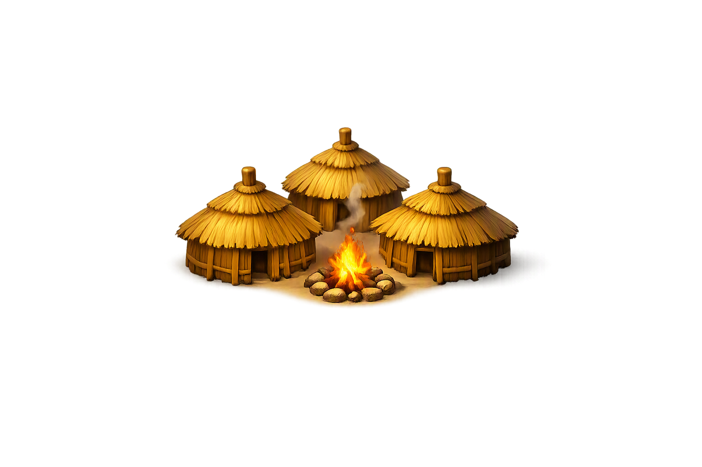 |
| Town | 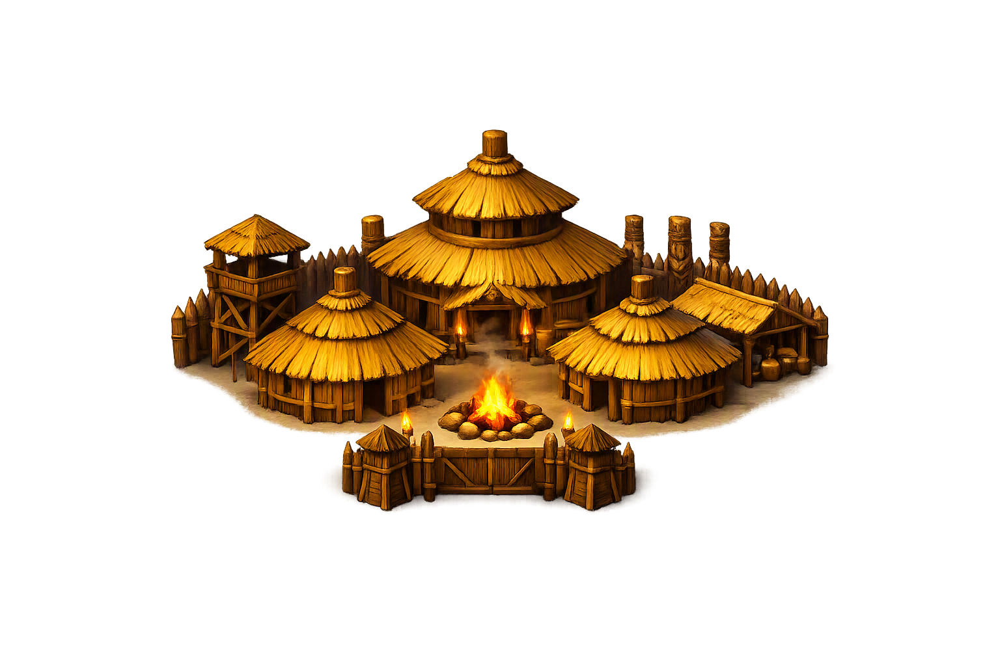 |
| City | 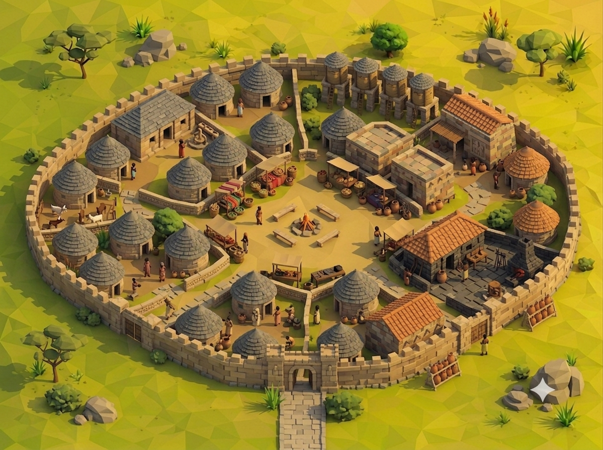 |
| Capital | 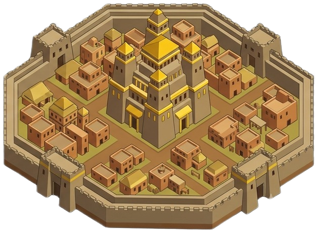 |

---

## ⚓ Harbors & Naval Units

Harbors are built on water tiles adjacent to your land. They produce naval units independently of cities.

| Naval Unit | Image | Move | Attack | Defence | HP | Cost | Tech Required | Attack Range |
|------------|-------|------|--------|---------|----|------|---------------|--------------|
| Raft | 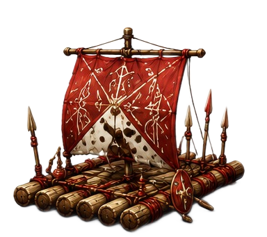 | 1 | 0 | 0 | 8 | 20 | Sailing | 0 |
| Galley | 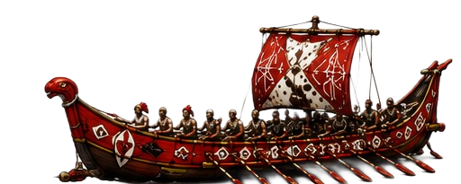 | 3 | 2 | 1 | 15 | 40 | Navigation | 1 |
| Warship | 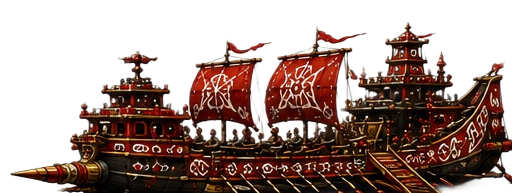 | 2 | 5 | 4 | 25 | 70 | Shipbuilding | 2 |

---

## 🔬 Technology Tree

Research technologies in your cities to unlock new units, bonuses, and abilities.

| Tier | Technology | Cost | Prerequisites | Bonus |
|------|------------|------|---------------|-------|
| 0 | **Masonry** | 30 | – | +1 defence for all cities |
| 0 | **Bronze Working** | 40 | – | +1 attack for all units |
| 0 | **Horseback Riding** | 50 | – | +1 move for mounted units |
| 0 | **Sailing** | 45 | – | Unlocks Harbors & Rafts |
| 1 | **Iron Working** | 60 | Bronze Working | +2 attack for foot units |
| 1 | **Engineering** | 70 | Masonry | +5 HP for all units |
| 1 | **Philosophy** | 80 | Masonry | +20% research speed |
| 1 | **Navigation** | 65 | Sailing | Unlocks Galleys |
| 2 | **Trade** | 55 | Philosophy | +2 gold per city |
| 2 | **Architecture** | 60 | Masonry, Engineering | City upgrades cost 20% less |
| 2 | **Medicine** | 70 | Philosophy | Units heal +3 HP per turn |
| 2 | **Siegecraft** | 75 | Iron Working | +2 attack against cities |
| 2 | **Shipbuilding** | 85 | Navigation | Unlocks Warships |
| 3 | **Steel Working** | 90 | Iron Working, Engineering | +2 attack for all units |

---

## 🏛️ Wonders

Construct wonders in your cities to gain permanent, empire-wide bonuses.

| Wonder | Cost | Requires | Bonus |
|--------|------|----------|-------|
| **Pyramids of Giza** | 120 | Masonry | +5 gold per turn |
| **Great Zimbabwe** | 140 | Bronze Working | +3 production per city |
| **University of Timbuktu** | 100 | Philosophy | +4 research per turn |
| **Axum Obelisks** | 90 | Masonry | +2 vision for all units |

---

## ⚔️ Combat System

Combat is resolved with a randomised damage formula:

Attack Power = (Attacker ATK + boosts) + random(-1, +1)
Defence Power = (Defender DEF + boosts) + random(-1, +1)
Damage to Defender = max(1, floor(AttackRoll - DefenceRoll × 0.6 + 2))
Damage to Attacker = max(0, floor(DefenceRoll - AttackRoll × 0.4 + 1))

**Key Rules:**
- **Both units** take damage in every combat.
- If a unit's HP reaches 0, it is removed from the game.
- Attacking a city captures it **only if no enemy unit** is defending that tile.
- Ranged units (attack range 2) can attack from a distance without taking counter-damage.

---

## 💚 Healing & Invigorate

### First Aid (All Units)
Any unit may spend its turn to heal approximately 25% of its maximum HP.  
*Button: 💚 First Aid* – appears in the unit action menu.

### Invigorate (Generals Only)
A General may spend its turn to inspire nearby troops. All friendly units within a **3-hex radius** are affected:

- **Injured units** are healed for approximately 40% of their max HP.
- **Full-health units** receive +1 Attack and +1 Defence for **1 turn** (indicated by a purple dashed ring).

*Button: ✨ Invigorate* – appears when a General is selected.

---

## 🛡️ The Twelve Tribes

---

### 1. Zulu

**“Fierce warriors of the south”**  
*Spirit: IsiZulu – Courage*

The Zulu are relentless warriors, feared for their discipline and ferocity in battle. Under the legendary King Shaka, they forged one of the most formidable military machines in African history.

- **Colour:** ■ Crimson
- **General:** Shaka
- **General Ability:** All units gain +1 Attack
- **AI Tactic:** Rush – aggressive early expansion

#### Unit Roster

| Unit | Image | Move | Attack | Defence | HP | Cost | Tech Required | Range |
|------|-------|------|--------|---------|----|------|---------------|-------|
| Impi Scout | 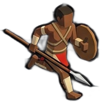 | 5 | 1 | 1 | 12 | 20 | – | 1 |
| Impi Warrior | 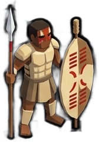 | 2 | 5 | 4 | 20 | 40 | – | 1 |
| Mounted Impi | 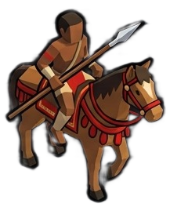 | 4 | 6 | 3 | 22 | 55 | Horseback | 1 |
| Shield Bearer | 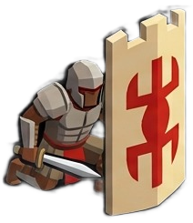 | 2 | 2 | 7 | 26 | 45 | Masonry | 1 |
| Assegai Thrower | 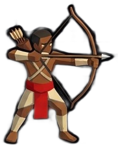 | 2 | 6 | 2 | 16 | 50 | Bronze Working | 2 |
| Zulu Elite | 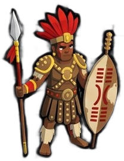 | 3 | 7 | 5 | 28 | 70 | Iron Working | 1 |
| War Elephant | 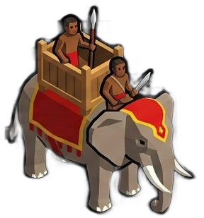 | 2 | 8 | 7 | 40 | 100 | Engineering | 1 |
| **Shaka** (General) | 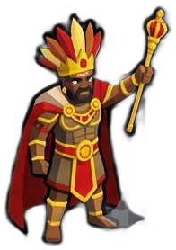 | 3 | 6 | 5 | 30 | 120 | Philosophy | 1 |

---

### 2. Ashanti

**“Golden kingdom of the west”**  
*Spirit: Sikadwa – Golden Stool*

The Ashanti Empire was built on gold and trade. Their warriors are disciplined, their cities wealthy, and their Golden Stool is a symbol of unity and power.

- **Colour:** ■ Gold
- **General:** Osei Tutu
- **General Ability:** +1 gold per city
- **AI Tactic:** Balanced – flexible unit mix

#### Unit Roster

| Unit | Image | Move | Attack | Defence | HP | Cost | Tech Required | Range |
|------|-------|------|--------|---------|----|------|---------------|-------|
| Akyeame Scout | 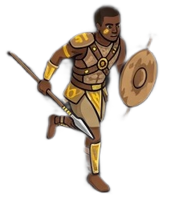 | 5 | 1 | 1 | 12 | 20 | – | 1 |
| Ashanti Warrior | 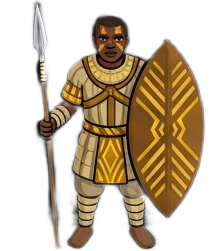 | 2 | 4 | 4 | 20 | 40 | – | 1 |
| Mounted Noble | 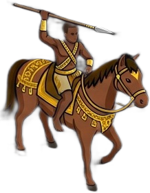 | 4 | 5 | 4 | 22 | 55 | Horseback | 1 |
| Golden Shield | 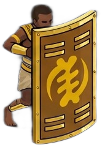 | 2 | 2 | 7 | 26 | 45 | Masonry | 1 |
| Bowman | 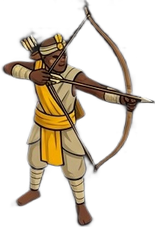 | 2 | 5 | 3 | 16 | 50 | Bronze Working | 2 |
| Ashanti Elite | 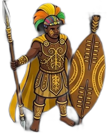 | 3 | 6 | 6 | 28 | 70 | Iron Working | 1 |
| War Elephant | 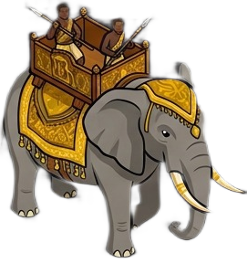 | 2 | 8 | 7 | 40 | 100 | Engineering | 1 |
| **Osei Tutu** (General) | 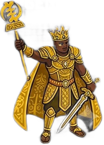 | 3 | 6 | 5 | 30 | 120 | Philosophy | 1 |

---

### 3. Yoruba

**“Spiritual warriors of the forest”**  
*Spirit: Igi – Forest*

The Yoruba are deeply spiritual people, drawing strength from the forests and the wisdom of their ancestors. Their warriors are guided by the Orishas, and their cities are centres of art and mysticism.

- **Colour:** ■ Forest Green
- **General:** Oranmiyan
- **General Ability:** Units heal +2 HP per turn
- **AI Tactic:** Defensive – fortifies cities

#### Unit Roster

| Unit | Image | Move | Attack | Defence | HP | Cost | Tech Required | Range |
|------|-------|------|--------|---------|----|------|---------------|-------|
| Ode Scout | 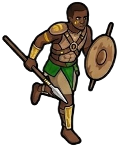 | 5 | 1 | 1 | 12 | 20 | – | 1 |
| Ogun Warrior | 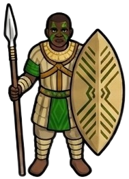 | 2 | 5 | 3 | 20 | 40 | – | 1 |
| Equestrian | 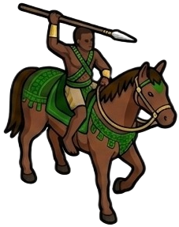 | 4 | 5 | 4 | 22 | 55 | Horseback | 1 |
| Shield Bearer | 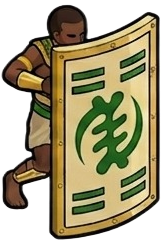 | 2 | 2 | 7 | 26 | 45 | Masonry | 1 |
| Ofa Archer | 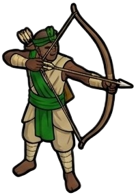 | 2 | 6 | 2 | 16 | 50 | Bronze Working | 2 |
| Yoruba Elite | 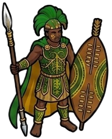 | 3 | 7 | 5 | 28 | 70 | Iron Working | 1 |
| Sacred Elephant | 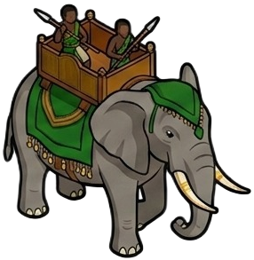 | 2 | 8 | 7 | 40 | 100 | Engineering | 1 |
| **Oranmiyan** (General) | 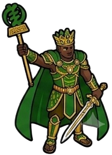 | 3 | 6 | 5 | 30 | 120 | Philosophy | 1 |

---

### 4. Maasai

**“Lion-hearted nomads of the savanna”**  
*Spirit: Oleng – Speed*

The Maasai are proud nomads, living in harmony with the savanna and its wildlife. Their warriors – the Moran – are renowned for their bravery, speed, and skill with the spear.

- **Colour:** ■ Crimson / ■ Orange
- **General:** Mbatian
- **General Ability:** +1 move for all units
- **AI Tactic:** Mobile – fast hit-and-run

#### Unit Roster

| Unit | Image | Move | Attack | Defence | HP | Cost | Tech Required | Range |
|------|-------|------|--------|---------|----|------|---------------|-------|
| Moran Scout | 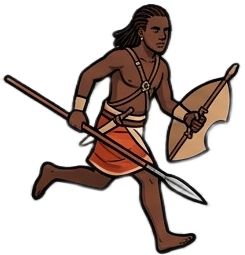 | 6 | 1 | 1 | 12 | 20 | – | 1 |
| Moran Warrior | 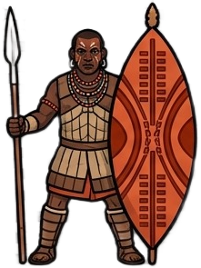 | 3 | 5 | 3 | 20 | 40 | – | 1 |
| Mounted Moran |  | 5 | 6 | 3 | 22 | 55 | Horseback | 1 |
| Shield Bearer | 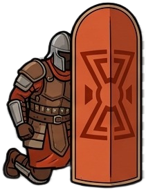 | 2 | 2 | 6 | 24 | 45 | Masonry | 1 |
| Olmoran Archer | 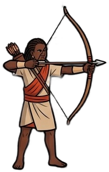 | 3 | 6 | 2 | 16 | 50 | Bronze Working | 2 |
| Maasai Elite | 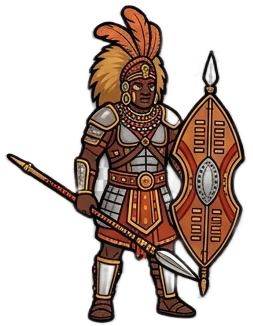 | 4 | 7 | 4 | 26 | 70 | Iron Working | 1 |
| War Elephant | 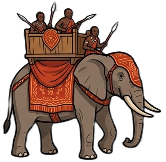 | 2 | 7 | 7 | 38 | 100 | Engineering | 1 |
| **Mbatian** (General) | 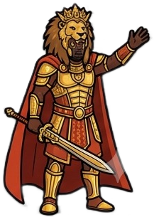 | 4 | 6 | 4 | 28 | 120 | Philosophy | 1 |

---

### 5. Berber

**“Desert riders of the north”**  
*Spirit: Aghwas – Desert*

The Berbers are masters of the Sahara, riding swift camels across the endless dunes. Their hit-and-run tactics and knowledge of the desert make them formidable opponents.

- **Colour:** ■ Sand
- **General:** Kahina
- **General Ability:** Desert combat bonus
- **AI Tactic:** Hit-and-run – skirmish tactics

#### Unit Roster

| Unit | Image | Move | Attack | Defence | HP | Cost | Tech Required | Range |
|------|-------|------|--------|---------|----|------|---------------|-------|
| Desert Scout | 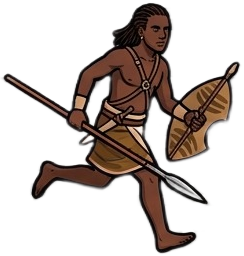 | 6 | 1 | 1 | 12 | 20 | – | 1 |
| Berber Warrior | 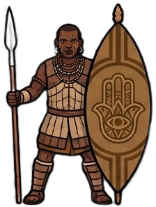 | 2 | 4 | 4 | 20 | 40 | – | 1 |
| Camel Rider | 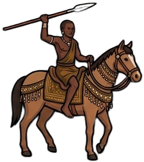 | 5 | 6 | 4 | 24 | 55 | Horseback | 1 |
| Shield Bearer | 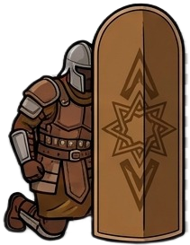 | 2 | 2 | 7 | 26 | 45 | Masonry | 1 |
| Berber Archer | 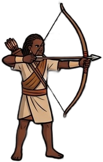 | 2 | 5 | 3 | 16 | 50 | Bronze Working | 2 |
| Berber Elite | 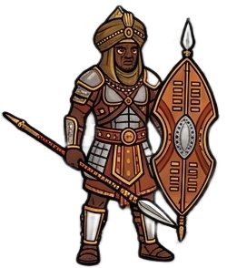 | 4 | 6 | 5 | 28 | 70 | Iron Working | 1 |
| War Camel | 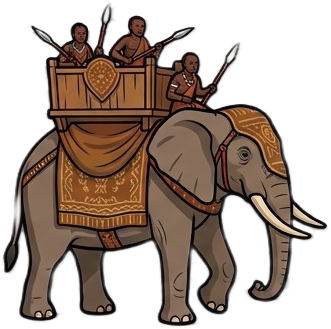 | 3 | 7 | 6 | 36 | 100 | Engineering | 1 |
| **Kahina** (General) | 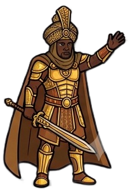 | 3 | 6 | 5 | 30 | 120 | Philosophy | 1 |

---

### 6. Hausa

**“Trading empire of the Sahel”**  
*Spirit: Kasuwa – Market*

The Hausa city-states are the great merchants of West Africa. Their wealth flows from trade routes that cross the Sahara, and their armies are well-equipped and disciplined.

- **Colour:** ■ Brown
- **General:** Amina
- **General Ability:** Trade routes +2 gold
- **AI Tactic:** Trade – economic focus

#### Unit Roster

| Unit | Image | Move | Attack | Defence | HP | Cost | Tech Required | Range |
|------|-------|------|--------|---------|----|------|---------------|-------|
| Dan Kasuwa Scout | 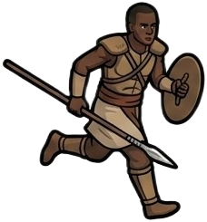 | 5 | 1 | 1 | 12 | 20 | – | 1 |
| Hausa Warrior | 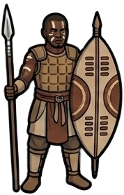 | 2 | 4 | 4 | 20 | 40 | – | 1 |
| Mounted Warrior | 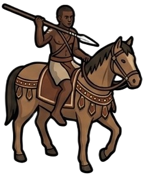 | 4 | 5 | 4 | 22 | 55 | Horseback | 1 |
| Shield Bearer | 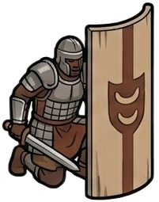 | 2 | 2 | 7 | 26 | 45 | Masonry | 1 |
| Hausa Bowman |  | 2 | 5 | 2 | 16 | 50 | Bronze Working | 2 |
| Hausa Elite |  | 3 | 6 | 5 | 28 | 70 | Iron Working | 1 |
| War Elephant |  | 2 | 8 | 7 | 40 | 100 | Engineering | 1 |
| **Amina** (General) |  | 3 | 7 | 4 | 28 | 120 | Philosophy | 1 |

---

### 7. Dogon

**“Mystical cliff-dwellers of Mali”**  
*Spirit: Nommo – Vision*

The Dogon people are known for their deep astronomical knowledge and their cliff-side villages. Their warriors are guardians of ancient secrets, and their vision extends far beyond the battlefield.

- **Colour:** ■ Grey-Blue
- **General:** Nommo
- **General Ability:** Vision range +2
- **AI Tactic:** Defensive – strong fortifications

#### Unit Roster

| Unit | Image | Move | Attack | Defence | HP | Cost | Tech Required | Range |
|------|-------|------|--------|---------|----|------|---------------|-------|
| Cliff Scout |  | 5 | 1 | 1 | 12 | 20 | – | 1 |
| Dogon Warrior |  | 2 | 4 | 4 | 20 | 40 | – | 1 |
| Mounted Hunter |  | 4 | 5 | 3 | 22 | 55 | Horseback | 1 |
| Shield Bearer |  | 2 | 2 | 7 | 26 | 45 | Masonry | 1 |
| Dogon Archer |  | 2 | 6 | 2 | 16 | 50 | Bronze Working | 2 |
| Dogon Elite |  | 3 | 6 | 6 | 28 | 70 | Iron Working | 1 |
| War Elephant |  | 2 | 7 | 7 | 38 | 100 | Engineering | 1 |
| **Nommo** (General) |  | 3 | 5 | 6 | 30 | 120 | Philosophy | 1 |

---

### 8. Songhai

**“Mighty river empire of the Niger”**  
*Spirit: Zarma – River*

The Songhai Empire stretched along the Niger River, controlling trade and military might across West Africa. Their river fleets and disciplined armies made them one of the continent's greatest powers.

- **Colour:** ■ Yellow-Orange
- **General:** Askia
- **General Ability:** +1 attack for all units
- **AI Tactic:** River Rush – uses rivers for rapid expansion

#### Unit Roster

| Unit | Image | Move | Attack | Defence | HP | Cost | Tech Required | Range |
|------|-------|------|--------|---------|----|------|---------------|-------|
| River Scout |  | 5 | 1 | 1 | 12 | 20 | – | 1 |
| Songhai Warrior |  | 2 | 5 | 3 | 20 | 40 | – | 1 |
| Mounted Warrior |  | 4 | 6 | 3 | 22 | 55 | Horseback | 1 |
| Shield Bearer |  | 2 | 2 | 7 | 26 | 45 | Masonry | 1 |
| Canoe Archer |  | 2 | 6 | 2 | 16 | 50 | Bronze Working | 2 |
| Songhai Elite |  | 3 | 7 | 5 | 28 | 70 | Iron Working | 1 |
| War Elephant |  | 2 | 8 | 7 | 40 | 100 | Engineering | 1 |
| **Askia** (General) |  | 3 | 7 | 5 | 30 | 120 | Philosophy | 1 |

---

### 9. Oromo

**“Highland warriors of Ethiopia”**  
*Spirit: Gada – Highland*

The Oromo people are fierce highland warriors, defending their mountain homelands with unmatched courage. Their Gada system produces leaders of great wisdom and martial skill.

- **Colour:** ■ Green
- **General:** Gada
- **General Ability:** Highland combat bonus
- **AI Tactic:** Highland – favours hills

#### Unit Roster

| Unit | Image | Move | Attack | Defence | HP | Cost | Tech Required | Range |
|------|-------|------|--------|---------|----|------|---------------|-------|
| Highland Scout |  | 5 | 1 | 1 | 12 | 20 | – | 1 |
| Oromo Warrior |  | 2 | 5 | 4 | 20 | 40 | – | 1 |
| Mounted Warrior |  | 4 | 6 | 4 | 22 | 55 | Horseback | 1 |
| Shield Bearer |  | 2 | 2 | 7 | 26 | 45 | Masonry | 1 |
| Oromo Archer |  | 2 | 5 | 3 | 16 | 50 | Bronze Working | 2 |
| Oromo Elite |  | 3 | 7 | 6 | 28 | 70 | Iron Working | 1 |
| War Elephant |  | 2 | 8 | 7 | 40 | 100 | Engineering | 1 |
| **Gada** (General) |  | 3 | 6 | 6 | 30 | 120 | Philosophy | 1 |

---

### 10. Tutsi

**“Cattle-herding nobility of Rwanda”**  
*Spirit: Inka – Cattle*

The Tutsi are a pastoral people, their wealth measured in cattle. Their warriors are tall and proud, defending their herds and their lands with fierce loyalty.

- **Colour:** ■ Dark Brown
- **General:** Rwanda
- **General Ability:** Cattle provide +1 gold
- **AI Tactic:** Cattle Raids – raiding economy

#### Unit Roster

| Unit | Image | Move | Attack | Defence | HP | Cost | Tech Required | Range |
|------|-------|------|--------|---------|----|------|---------------|-------|
| Cattle Scout |  | 5 | 1 | 1 | 12 | 20 | – | 1 |
| Tutsi Warrior |  | 2 | 4 | 4 | 20 | 40 | – | 1 |
| Mounted Warrior |  | 4 | 5 | 4 | 22 | 55 | Horseback | 1 |
| Shield Bearer |  | 2 | 2 | 7 | 26 | 45 | Masonry | 1 |
| Tutsi Archer |  | 2 | 5 | 3 | 16 | 50 | Bronze Working | 2 |
| Tutsi Elite |  | 3 | 6 | 6 | 28 | 70 | Iron Working | 1 |
| War Elephant |  | 2 | 7 | 7 | 38 | 100 | Engineering | 1 |
| **Rwanda** (General) |  | 3 | 6 | 5 | 30 | 120 | Philosophy | 1 |

---

### 11. Swahili

**“Coastal traders of East Africa”**  
*Spirit: Bahari – Ocean*

The Swahili are masters of the Indian Ocean trade, their dhows carrying goods from Kilwa to Zanzibar and beyond. Their cities are wealthy, their culture rich, and their fleets formidable.

- **Colour:** ■ Teal
- **General:** Tippu Tip
- **General Ability:** Trade +3 gold per turn
- **AI Tactic:** Trade – naval and trade focus

#### Unit Roster

| Unit | Image | Move | Attack | Defence | HP | Cost | Tech Required | Range |
|------|-------|------|--------|---------|----|------|---------------|-------|
| Dhow Scout |  | 6 | 1 | 1 | 12 | 20 | – | 1 |
| Swahili Warrior |  | 2 | 4 | 3 | 20 | 40 | – | 1 |
| Coastal Rider |  | 4 | 5 | 3 | 22 | 55 | Horseback | 1 |
| Shield Bearer |  | 2 | 2 | 7 | 26 | 45 | Masonry | 1 |
| Swahili Archer |  | 2 | 5 | 3 | 16 | 50 | Bronze Working | 2 |
| Swahili Elite |  | 3 | 6 | 5 | 28 | 70 | Iron Working | 1 |
| War Elephant |  | 2 | 7 | 7 | 38 | 100 | Engineering | 1 |
| **Tippu Tip** (General) |  | 3 | 5 | 5 | 30 | 120 | Philosophy | 1 |

---

### 12. Nubian

**“Archers of the Nile Valley”**  
*Spirit: Nile – Archery*

The Nubians are legendary archers, their bows feared from the cataracts of the Nile to the deserts beyond. Their kingdom of Kush was a rival to Egypt, and their warriors are masters of the bow.

- **Colour:** ■ Dark Tan
- **General:** Taharqa
- **General Ability:** Archers +1 range
- **AI Tactic:** Archer – ranged-unit emphasis

#### Unit Roster

| Unit | Image | Move | Attack | Defence | HP | Cost | Tech Required | Range |
|------|-------|------|--------|---------|----|------|---------------|-------|
| Nile Scout |  | 5 | 1 | 1 | 12 | 20 | – | 1 |
| Nubian Warrior |  | 2 | 4 | 4 | 20 | 40 | – | 1 |
| Mounted Archer |  | 4 | 6 | 3 | 22 | 55 | Horseback | 1 |
| Shield Bearer |  | 2 | 2 | 7 | 26 | 45 | Masonry | 1 |
| Nubian Archer |  | 2 | 7 | 2 | 16 | 50 | Bronze Working | 2 |
| Nubian Elite |  | 3 | 7 | 5 | 28 | 70 | Iron Working | 1 |
| War Elephant |  | 2 | 8 | 7 | 40 | 100 | Engineering | 1 |
| **Taharqa** (General) |  | 3 | 7 | 5 | 30 | 120 | Philosophy | 1 |

---

## 🧠 AI Personalities

Each AI-controlled tribe follows a tactical style based on its historical counterpart:

| Tribe | Tactic | Description |
|-------|--------|-------------|
| Zulu | Rush | Aggressive early expansion |
| Ashanti | Balanced | Flexible unit mix |
| Yoruba | Defensive | Fortifies cities |
| Maasai | Mobile | Fast hit-and-run |
| Berber | Hit-and-run | Skirmish tactics |
| Hausa | Trade | Economic focus |
| Dogon | Defensive | Strong fortifications |
| Songhai | River Rush | Uses rivers for rapid expansion |
| Oromo | Highland | Favours hills |
| Tutsi | Cattle Raids | Raiding economy |
| Swahili | Trade | Naval and trade focus |
| Nubian | Archer | Ranged-unit emphasis |

---

## 📜 Lore & Myths

### The Prophecy of the Oba

> *“In the time before memory, the great Oba – King of all tribes – divided the land among his twelve children. To each he gave a gift: the Zulu received the Courage of the Buffalo, the Ashanti the Wisdom of the Golden Stool, the Yoruba the Mystery of the Forest, and so on. For centuries the tribes lived in peace, honouring the Oba’s covenant.*
>
> *But now the covenant is forgotten. The tribes grow restless, and the drums of war echo across the savanna. The Oba’s prophecy speaks of a new ruler – one who will unite the kingdoms… or destroy them all.”*

### The Twelve Spirits

| Tribe | Spirit | Meaning |
|-------|--------|---------|
| Zulu | *IsiZulu* | Courage |
| Ashanti | *Sikadwa* | Golden Stool |
| Yoruba | *Igi* | Forest |
| Maasai | *Oleng* | Speed |
| Berber | *Aghwas* | Desert |
| Hausa | *Kasuwa* | Market |
| Dogon | *Nommo* | Vision |
| Songhai | *Zarma* | River |
| Oromo | *Gada* | Highland |
| Tutsi | *Inka* | Cattle |
| Swahili | *Bahari* | Ocean |
| Nubian | *Nile* | Archery |

### The Lost City of Meroe

> *“Legends say that the first city – Meroe – was built by the gods themselves. Its ruins are said to hold the secret of immortality, and the spirits of the ancient kings still guard its treasures. Many have searched for Meroe, but none have returned…”*

### The Whispering Baobab

> *“On the edge of the great savanna stands a baobab tree older than any kingdom. Its leaves whisper the names of every king who has ever ruled, and its roots reach down into the underworld. It is said that if you listen closely, you can hear the voices of the ancestors guiding you.”*

### The Legend of the Golden Stool

> *“The Ashanti Golden Stool descended from the heavens in a cloud of dust. It contains the soul of the Ashanti nation, and no king may sit upon it without the approval of the spirits. To this day, it is said that the stool remains hidden, waiting for the true leader to claim it.”*

### The Tale of Shaka's Spear

> *“Shaka, the great Zulu king, forged a spear unlike any other – the *iklwa*, named for the sound it made as it pierced an enemy's heart. It is said that the spirit of the buffalo lives within this spear, granting courage to all who fight beneath its banner.”*

### The Song of the Niger

> *“The Niger River is not a river at all – it is the serpent of the gods, coiled around the land. Its waters carry the wisdom of the ancestors, and those who sail its length gain knowledge of all that was and all that will be. The Songhai call it *Joliba* – the Great Water.”*

### The Eye of the Dogon

> *“The Dogon knew of a star that no eye could see – a companion to Sirius, invisible yet powerful. They say that the spirit Nommo gave them this knowledge so that they might always see beyond the veil, to know the truth of the world and the stars beyond.”*

---

## 🎯 Tips for New Players

1. **Expand early** – capture neutral villages to boost your income and production.
2. **Prioritise technology** – Sailing opens naval options; Medicine provides passive healing.
3. **Use your General wisely** – Invigorate can turn the tide of a battle.
4. **Keep scouts moving** – vision is critical for planning and defence.
5. **Respect terrain** – mountains cost extra movement; plan your routes.
6. **Upgrade cities** – invest gold to increase production and influence.
7. **Build harbors** – place them on water tiles adjacent to your land; they build ships independently.
8. **Watch the fog of war** – explored areas remain dimly visible, but enemy movements can be hidden.
9. **Diversify your army** – a mix of melee, ranged, and naval units provides tactical flexibility.
10. **Study your enemies** – each tribe's AI personality influences their behaviour; adapt accordingly.

---

*— Wiki for **Oba – Rise of Kingdoms** v4.4*  
*All PNG filenames correspond to assets in the game directory.*

*May the spirits guide your path.*
